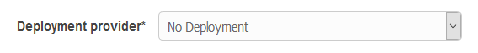
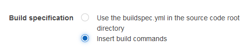

# Implementing Serverless CICD Pipeline with AWS

## Tools Used 
- AWS CodePipeline 
- AWS CodeBuild 
- AWS Simple Notification Service  
- Serverless Framework

## Building the CodePipeline
1.	Open CodePipeline Service in aws console. <br/>
    (https://*region*.console.aws.amazon.com/codepipeline)

2.	Before creating a new pipeline, select the region of your choice from top left corner region selection option
    

3.	Select **Get started** or **Create pipeline**.

4.	Choose **Next step**

5.	In Step 2: Source, select Source provider as GitHub from the dropdown
    

6.	Choose **Connect to GitHub** if not already signed in

7.	Select Repository **_desired-repository_**

8.	Select **_desired-Branch_**

9.	Choose **Next Step**

10.	In Step 3: Build, select Build provider as **AWS CodeBuild**
    

11.	Under Configure your project, select **Create a new build project**
-	For Project name enter **_desired-Project-Name_**
-	For Operating system, select **Ubuntu**
-	For Runtime, select **Node.js**
-	For Version, select **aws/codebuild/nodejs:8.11.0**
-   Leave the Role name under AWS CodeBuild service role as default 
-	Open Advanced section

12.	By default, **service role** will not have required **permissions**
-	Open IAM console
-	Select the **service role**
-	Create & Assign below **custom policy**
    ```
    {
    "Statement": [
        {
            "Action": [
                "s3:GetObject",
                "s3:GetObjectVersion",
                "s3:GetBucketVersioning"
            ],
            "Resource": "*",
            "Effect": "Allow"
        },
        {
            "Action": [
                "s3:PutObject"
            ],
            "Resource": [
                "arn:aws:s3:::codepipeline*",
                "arn:aws:s3:::elasticbeanstalk*"
            ],
            "Effect": "Allow"
        },
        {
            "Action": [
                "elasticbeanstalk:*",
                "ec2:*",
                "elasticloadbalancing:*",
                "autoscaling:*",
                "cloudwatch:*",
                "s3:*",
                "sns:*",
                "cloudformation:*",
                "rds:*",
                "sqs:*",
                "ecs:*",
                "apigateway:*",
                "iam:PassRole",
                "iam:GetRole"
            ],
            "Resource": "*",
            "Effect": "Allow"
        },
        {
            "Action": [
                "lambda:*"
            ],
            "Resource": "*",
            "Effect": "Allow"
        },
        {
            "Action": [
                "cloudformation:CreateStack",
                "cloudformation:DeleteStack",
                "cloudformation:DescribeStacks",
                "cloudformation:UpdateStack",
                "cloudformation:CreateChangeSet",
                "cloudformation:DeleteChangeSet",
                "cloudformation:DescribeChangeSet",
                "cloudformation:ExecuteChangeSet",
                "cloudformation:SetStackPolicy",
                "cloudformation:ValidateTemplate",
                "iam:PassRole",
                "iam:GetRole",
                "iam:PutRolePolicy"
            ],
            "Resource": "*",
            "Effect": "Allow"
        },
        {
            "Action": [
                "codebuild:BatchGetBuilds",
                "codebuild:StartBuild"
            ],
            "Resource": "*",
            "Effect": "Allow"
        },
        {
            "Effect": "Allow",
            "Action": [
                "devicefarm:ListProjects",
                "devicefarm:ListDevicePools",
                "devicefarm:GetRun",
                "devicefarm:GetUpload",
                "devicefarm:CreateUpload",
                "devicefarm:ScheduleRun"
            ],
            "Resource": "*"
        }
    ],
    "Version": "2012-10-17"
    }
    ```
-   Name policy as **_desired-service-role-policy-name_**

13.	Choose **Next step** in **CodePipeline** console

14.	Select No Deployment in deploy stage
    

15.	Choose **Next step**

16.	Create a service role in IAM to give AWS CodePipeline permission to use resources in your account. If you already have a service role configured for this purpose, you can choose it from the list instead of creating a role. However, if that role is not configured correctly, AWS CodePipeline might not work as expected.

17.	Create & Assign below **custom policy** to the service role for codepipeline
```
{
    "Statement": [
        {
            "Action": [
                "s3:GetObject",
                "s3:GetObjectVersion",
                "s3:GetBucketVersioning"
            ],
            "Resource": "*",
            "Effect": "Allow"
        },
        {
            "Action": [
                "s3:PutObject"
            ],
            "Resource": [
                "arn:aws:s3:::codepipeline*",
                "arn:aws:s3:::elasticbeanstalk*"
            ],
            "Effect": "Allow"
        },
        {
            "Action": [
                "elasticbeanstalk:*",
                "ec2:*",
                "elasticloadbalancing:*",
                "autoscaling:*",
                "cloudwatch:*",
                "s3:*",
                "sns:*",
                "cloudformation:*",
                "rds:*",
                "sqs:*",
                "ecs:*",
                "iam:PassRole",
                "iam:GetRole"
            ],
            "Resource": "*",
            "Effect": "Allow"
        },
        {
            "Action": [
                "lambda:*"
            ],
            "Resource": "*",
            "Effect": "Allow"
        },
        {
            "Action": [
                "cloudformation:CreateStack",
                "cloudformation:DeleteStack",
                "cloudformation:DescribeStacks",
                "cloudformation:UpdateStack",
                "cloudformation:CreateChangeSet",
                "cloudformation:DeleteChangeSet",
                "cloudformation:DescribeChangeSet",
                "cloudformation:ExecuteChangeSet",
                "cloudformation:SetStackPolicy",
                "cloudformation:ValidateTemplate",
                "iam:PassRole",
                "iam:GetRole"
            ],
            "Resource": "*",
            "Effect": "Allow"
        },
        {
            "Action": [
                "codebuild:BatchGetBuilds",
                "codebuild:StartBuild"
            ],
            "Resource": "*",
            "Effect": "Allow"
        },
        {
            "Effect": "Allow",
            "Action": [
                "devicefarm:ListProjects",
                "devicefarm:ListDevicePools",
                "devicefarm:GetRun",
                "devicefarm:GetUpload",
                "devicefarm:CreateUpload",
                "devicefarm:ScheduleRun"
            ],
            "Resource": "*"
        }
    ],
    "Version": "2012-10-17"
}
```

18.	In Step 6: Review, choose **Create pipeline**


## Add additional stages for approval to the CodePipeline
1.	Go to the **pipeline** you created just now

2.	Choose **Edit**

3.	At the end of the desired **Staging**, choose **Stage**

4.	For Enter stage name, enter **_desired-Approval-Stage-Name_**

5.	Choose **Action**

6.	For Action category, select **Approval**

7.	For Action name, enter **_desired-Approval-Stage-Name_**

8.	For Approval type, select **Manual approval**

9.	Under Manual approval configuration, select arn for SNS topic already created or create new SNS topic

10.	 For Comments, enter **_desired-Comments_**

11.	 Choose **Add action**

12.	  Choose **Save pipeline changes**

13.	 Choose **Save and continue**

14.	 Can verify the new pipeline changes by choosing **Release change**

## Add additional stages for code testing to the CodePipeline
1.	Go to the **pipeline** you created just now

2.	Choose **Edit**

3.	At the end of the desired **Staging**, choose **Stage**

4.	For Enter stage name, enter **_desired-Test-Stage-Name_**

5.	Choose **Action**

6.	For Action category, select **Test**

7.	For Action name provide **_desired-Test-action-name_**

8.	Select the Test provider as **AWS CodeBuild**

9.	Create a new CodeBuild Project with project name as **_desired-project-name_**

10.	Configure the same environment as done earlier for **build/deployment stage**

11.	select **Build specification as Insert build commands**
    

12.	Add following build commands for example
    ```
    cd <desired-Folder-Name> && npm install && npm install -g serverless && npm run test
    ```
    

13.	Select the CodeBuild service role created earlier Then say **Save Build Project**

14.	You are done adding test stage to your CICD pipeline using serverless.<br/>
    Note: use below sample snippet to create and push buildspec.yml file in the root repository.
    ```
    version: 0.1
    phases:
        install:
            commands:
                - cd <desired-Folder-Name> && npm install
                - npm install -g serverless
                - echo Build enviromment `uname -a` `aws --version 2>&1` node/`node --version` npm/`npm --version`
        build:
            commands:
                - cd <desired-Folder-Name> && pwd && ls && serverless deploy
    ```